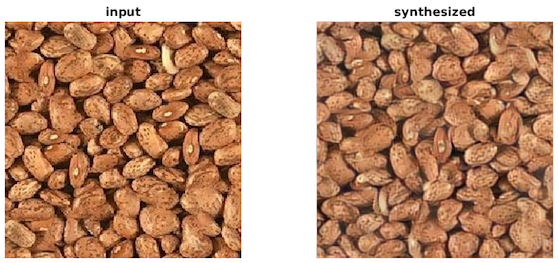

# Parametric models for texture
 
This repository contains the code for texture synthesis using CNN models

List of things to do:

	1. Texture experiments:
		1. DTD, FMD, KTH-2b datasets
		2. MIT Indoor, PASCAL VOC 2007
	2. Texture synthesis:
	 	1. Learn weights for various layers using a dataset of texture samples (take multiple crops and learn weights).
	 	2. Comparison of patch-based methods for texture synthesis
	3. Texture modification
		1. Constrained optimization problems with decribable attributes for editing the textures.

## Texture synthesis

Run the `texture_syn_demo.m` to see an example of texture synthesis. The code implements Gatys et al., NIPS 2015 using the Oxford's `vgg-verydeep-16` network. The code should produce the output below. On a NVIDIA K40 GPU the code takes about 7 minutes to reconstruct the image.

## Setup

### Install dependencies

The code depends on VLFEAT, MatConvNet, minFunc and imagequilt. Download and install these in the current directories. The code is tested under MatConvNet version `v1-beta15` modified to include bilinear and normalizaton layers. You can follow the detailed instructions on the project pages to install these on your local machine. For example, here are the steps I followed to install these on a MacBookPro laptop running MATLAB_R2014b. 

0. To install **MatConvNet** (w/o GPU support):

		>> git clone git@bitbucket.org:smaji/matconvnet-bilinear.git
		>> cd matconvnet
		>> make

0. To install **VLFEAT**:
	
		>> git clone git@github.com:vlfeat/vlfeat.git
		>> cd vlfeat
		>> make ARCH=maci64 MEX=/Applications/MATLAB_R2014b.app/bin/mex
	
0. To install **minFunc** (for L-BFGS) follow the instructions on the [project webpage](https://www.cs.ubc.ca/~schmidtm/Software/minFunc.html).

0. Optionally download files for [**imagequilt**](http://www.cs.princeton.edu/~cdecoro/imagequilting), a MATLAB implementation of Efros & Freeman 2001. This is needed to initialize texture with `opts.textureInit=quilt` option.

Then modify `setup.m` to point to the installed locations.

### Download ImageNet pre-trained CNNs

For the experiments in the paper we use these three CNNs: [imagenet-caffe-alex](http://www.vlfeat.org/matconvnet/models/imagenet-caffe-alex.mat), [imagenet-vgg-m](http://www.vlfeat.org/matconvnet/models/imagenet-vgg-m.mat), [imagenet-vgg-verydeep-16](http://www.vlfeat.org/matconvnet/models/imagenet-vgg-verydeep-16.mat).

Download these models and put them in `data/models` directory.